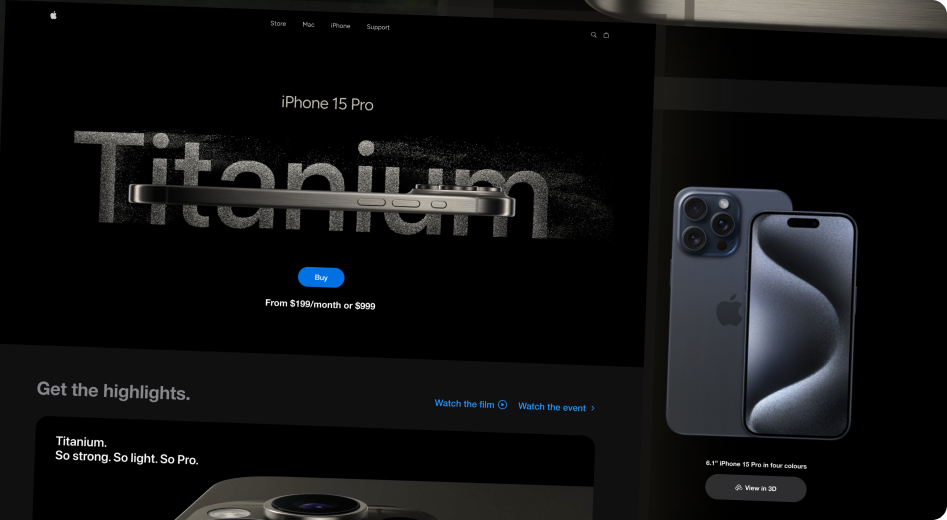

# Apple Website – Landing Page 3D

<p align="center">
  
</p>

[]()
[]()
[]()

---

## 💡 Descrição

Landing page inspirada no site da **Apple**, exibindo um modelo **3D interativo do iPhone** com animações suaves e design minimalista.  
O projeto tem como objetivo praticar conceitos de **React**, **Vite**, **TailwindCSS** e integração de modelos 3D para web.

---

## 📸 Demonstração

<p align="center">


</p>

---

## 🚀 Recursos Principais

- Modelo 3D do iPhone com interação em tempo real.
- Animações suaves de rotação e transição.
- Layout moderno, responsivo e inspirado no design da Apple.
- Performance otimizada com **Vite**.
- Estilização ágil e escalável com **TailwindCSS**.

---

## 🔧 Como Executar Localmente

```bash
# Clone este repositório
git clone https://github.com/Leandro-Kolosque/apple_website.git

# Acesse a pasta do projeto
cd apple_website

# Instale as dependências
npm install

# Execute o projeto em ambiente de desenvolvimento
npm run dev
```
## 🤝 Contribuição & Feedback

Contribuições são bem-vindas! Se você tiver sugestão de melhoria, correção de bugs, nova animação ou sugestão de layout, sinta-se à vontade para:

- Abrir uma *issue* aqui no repositório.  
- Enviar um *pull request* explicando detalhadamente o que fez.  

Também ficarei feliz com feedback — se achar que algo pode ser mais performático ou melhor visualmente, me chame; é sempre um aprendizado.

---

## 📬 Contato

**Leandro Kolosque**  
[GitHub](https://github.com/Leandro-Kolosque) <br>
[LinkedIn](https://www.linkedin.com/in/Leandro-Kolosque/)  <br>
[Email](mailto:leandro.wingerth@gmail.com)  <br>

---

## 🙏 Agradecimentos

Este projeto foi inspirado em conteúdos da **[JS Mastery](https://www.jsmastery.pro/)**, que compartilha tutoriais e cursos de alta qualidade sobre desenvolvimento moderno.


## 📄 Licença

Este projeto está licenciado sob a **MIT License** – consulte o arquivo [LICENSE](./LICENSE) para mais detalhes.
